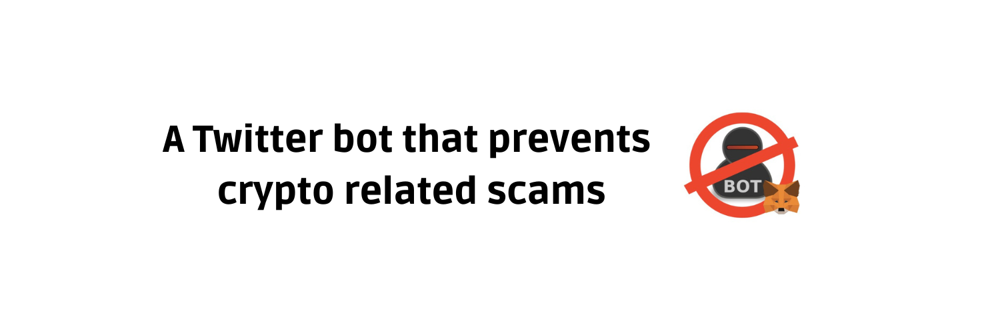

A Twitter bot that helps to prevent Metamask phishing related scams.

Built using Tweepy, Python and the Twitter API.

## How does it work? ❔
Anti Fraud bot will reply to any tweet containing the word "Metamask" with a warn message about phishing attacks and mention the official Metamask support account.

To see working examples see the [Tweets & Replies](https://twitter.com/antifraudbot/with_replies) page.

## Authors 👦

- Matias Rodriguez ([@rodriguezmatid](https://twitter.com/rodriguezmatid))
- Tadeo Donegana Braunschweig ([@tadeodonegana](https://twitter.com/tadeodonegana))

## Contributing ✅
PRs and issues are always welcome. Feel free to submit any issues or ideas you have at the [issues page](https://github.com/rodriguezmatid/Anti-Fraud-Bot/issues).